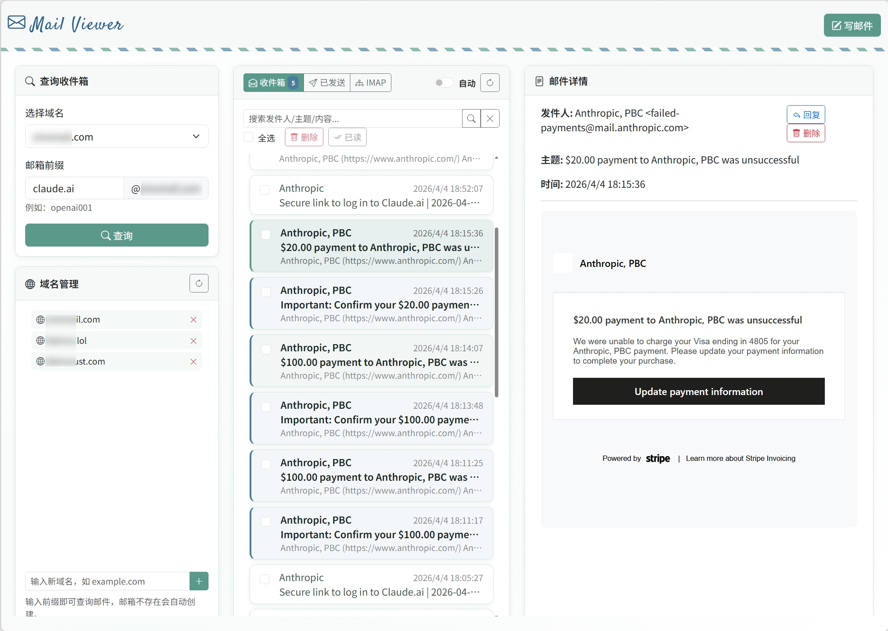

<div align="center">


**轻量级自建邮箱服务 —— 一键部署，开箱即用**

SMTP 收件 &bull; REST API &bull; Web 查看器 &bull; IMAP 桥接

[](https://python.org)
[](https://fastapi.tiangolo.com)
[](https://flask.palletsprojects.com)
[](https://nodejs.org)
[](https://www.mongodb.com)
[](https://docs.docker.com/compose/)
[](LICENSE)

**[English](README.md)**

---



<sub>*截图中所有邮件均为测试邮件，无实际意义。*</sub>

</div>

## 概述

ManyMail 是一套完整的自建邮箱解决方案，包含三个核心服务：

| 服务 | 技术栈 | 端口 | 说明 |
|:-----|:-------|:-----|:-----|
| **mail-service** | FastAPI + aiosmtpd | `:25` `:8080` | SMTP 收件 + DuckMail 兼容 REST API |
| **mail-viewer** | Flask + bleach | `:5000` | Web 邮件查看器，支持搜索、回复、发信 |
| **imap-bridge** | Node.js + imapflow | `:3939` | IMAP 桥接，接入 Gmail / Outlook / QQ 等 |

<br>

## 架构

```
    互联网                                 你的服务器
    ──────                                 ──────────
                      ┌──────────────────────────────────────────────┐
                      │                                              │
   外部邮件     ──────┤►  mail-service        ┌───────────────┐     │
   (SMTP :25)         │   (FastAPI+aiosmtpd)  │   MongoDB 7   │     │
                      │   ┌──────────────┐    │   ┌─────────┐ │     │
                      │   │ SMTP 处理器  │────┤►  │ accounts│ │     │
                      │   │ REST API     │◄───┤   │ messages│ │     │
                      │   └──────┬───────┘    │   │ domains │ │     │
                      │          │ :8080      └───┴─────────┘─┘     │
                      │          │                                    │
                      │          ▼                                    │
   浏览器      ───────┤►  mail-viewer          imap-bridge           │
   (HTTP :5000)       │   (Flask)              (Node.js)             │
                      │   ┌──────────────┐    ┌──────────────┐      │
                      │   │ 收件箱视图   │    │ Gmail        │      │
                      │   │ 搜索         │◄───┤ Outlook      │      │
                      │   │ 回复 / 发信  │    │ QQ / 163     │      │
                      │   │ HTML 安全过滤│    │ Yahoo / GMX  │      │
                      │   └──────────────┘    └──────────────┘      │
                      │                         :3939                 │
                      └──────────────────────────────────────────────┘
```

<br>

## 快速开始

### 1. 克隆并配置

```bash
git clone https://github.com/margbug01/ManyMail.git
cd ManyMail
cp .env.example .env
```

编辑 `.env`，填入实际值：

```env
# 邮件服务
JWT_SECRET=你的JWT密钥
API_KEY=你的API密钥
SMTP_HOSTNAME=mail.yourdomain.com
DOMAINS=yourdomain.com

# 邮件查看器
ACCESS_PASSWORD=查看器登录密码
SECRET_KEY=Flask会话密钥
UNIFIED_PASSWORD=邮箱统一密码
```

### 2. 部署

```bash
docker compose up -d
```

### 3. 验证

```bash
# 检查服务状态
docker compose ps

# 查看日志
docker compose logs -f

# 健康检查
curl http://127.0.0.1:8080/health
```

<br>

## DNS 配置

为你的域名添加以下 DNS 记录：

```dns
; MX 记录 — 告诉其他邮件服务器投递到哪里
yourdomain.com.       IN  MX   10  mail.yourdomain.com.

; A 记录 — 指向你的服务器 IP
mail.yourdomain.com.  IN  A        <你的服务器IP>

; SPF 记录 — 声明哪些 IP 可以代表你的域名发信
yourdomain.com.       IN  TXT      "v=spf1 ip4:<你的服务器IP> -all"

; DKIM 记录 — 邮件签名验证（需先生成密钥对）
default._domainkey.yourdomain.com.  IN  TXT  "v=DKIM1; k=rsa; p=<你的公钥>"

; DMARC 记录 — SPF/DKIM 验证失败时的处理策略
_dmarc.yourdomain.com.  IN  TXT  "v=DMARC1; p=quarantine; rua=mailto:dmarc@yourdomain.com"
```

> **STARTTLS**：ManyMail 支持 STARTTLS 加密传输。在 `docker-compose.yml` 中挂载 TLS 证书，并在 `.env` 中设置 `SMTP_TLS_CERT` / `SMTP_TLS_KEY`。详见 `.env.example`。

<br>

## API 参考

> 基础地址：`http://127.0.0.1:8080`
>
> 认证方式：`Authorization: Bearer <token>`（`/health`、`/token`、`/accounts` 除外）

### 账户管理

```http
POST /accounts              # 创建邮箱账户
POST /token                 # 登录获取 JWT Token
```

### 邮件操作

```http
GET  /messages              # 查询收件箱（分页：?offset=0&limit=30）
GET  /messages/{id}         # 获取邮件详情
GET  /messages/search?q=    # 全文搜索
PATCH /messages/{id}        # 标记已读 / 删除
GET  /sent                  # 已发送邮件列表
```

### 系统接口

```http
GET  /health                # 健康检查（无需认证）
GET  /domains               # 可用域名列表
```

<details>
<summary><strong>示例：创建账户并读取收件箱</strong></summary>

```bash
# 创建账户
curl -X POST http://127.0.0.1:8080/accounts \
  -H "Content-Type: application/json" \
  -d '{"address": "user@yourdomain.com", "password": "secret123"}'

# 获取 Token
TOKEN=$(curl -s -X POST http://127.0.0.1:8080/token \
  -H "Content-Type: application/json" \
  -d '{"address": "user@yourdomain.com", "password": "secret123"}' \
  | jq -r '.token')

# 查看收件箱
curl http://127.0.0.1:8080/messages \
  -H "Authorization: Bearer $TOKEN"
```

</details>

<br>

## 项目结构

```
ManyMail/
│
├── mail-service/                # SMTP + REST API 服务
│   ├── app.py                   #   FastAPI 主程序
│   ├── Dockerfile               #   Python 3.11-slim
│   └── requirements.txt         #   fastapi, aiosmtpd, pymongo, jwt, bcrypt
│
├── mail-viewer/                 # Web 邮件查看器
│   ├── app.py                   #   Flask 主程序
│   ├── Dockerfile               #   Python 3.11-slim + gunicorn
│   ├── requirements.txt         #   flask, bleach, tinycss2
│   ├── templates/
│   │   ├── index.html           #   收件箱界面
│   │   └── login.html           #   登录页面
│   └── imap-mail-app/           #   IMAP 桥接服务 (Node.js)
│       ├── server.js            #     Express REST API
│       ├── client.js            #     ImapFlow 封装
│       ├── config.js            #     邮件服务商预设配置
│       └── package.json         #     imapflow, mailparser
│
├── docker-compose.yml           # 统一编排 4 个服务
├── .env.example                 # 环境变量模板
├── deploy.sh                    # 部署脚本
├── test_smtp.py                 # SMTP 测试
└── test_external_smtp.py        # 外部 SMTP 测试
```

<br>

## 安全特性

| 层级 | 特性 |
|:-----|:-----|
| **认证** | JWT Token 鉴权（24h 自动过期）+ API Key 保护管理端点 |
| **密码** | bcrypt 哈希存储，不可逆 |
| **速率限制** | API 和 SMTP 双层 IP 限流，防止滥用 |
| **SMTP 防护** | IP 黑名单 / 灰名单，收件人数量限制，邮件大小限制 |
| **邮件渲染** | HTML 安全过滤 (bleach + CSSSanitizer)，iframe 沙箱隔离 |
| **网络安全** | 服务端图片代理，防止收件人 IP 泄露 |
| **数据清理** | MongoDB TTL 索引自动清理过期邮件（默认 3 天） |
| **访问控制** | 查看器登录保护，HttpOnly Session Cookie |

<br>

## 技术栈

<table>
<tr>
<td align="center" width="150"><br><strong>Python 3.11</strong><br>FastAPI &bull; Flask<br><br></td>
<td align="center" width="150"><br><strong>Node.js 20</strong><br>Express &bull; ImapFlow<br><br></td>
<td align="center" width="150"><br><strong>MongoDB 7</strong><br>pymongo<br><br></td>
<td align="center" width="150"><br><strong>Docker</strong><br>Compose<br><br></td>
</tr>
</table>

| 组件 | 依赖 |
|:-----|:-----|
| mail-service | `fastapi` `uvicorn` `aiosmtpd` `pymongo` `PyJWT` `bcrypt` |
| mail-viewer | `flask` `gunicorn` `requests` `bleach` `tinycss2` |
| imap-bridge | `express` `imapflow` `mailparser` `dotenv` |

<br>

## 社区

ManyMail 感谢 [linux.do](https://linux.do/) 社区。这里有很多真实、友好的技术分享，也给了这个项目不少自托管和产品体验方面的启发。

<br>

## 许可证

[MIT](LICENSE)

---

<div align="center">
<sub>为自托管而生，掌控你自己的邮件基础设施。</sub>
</div>
